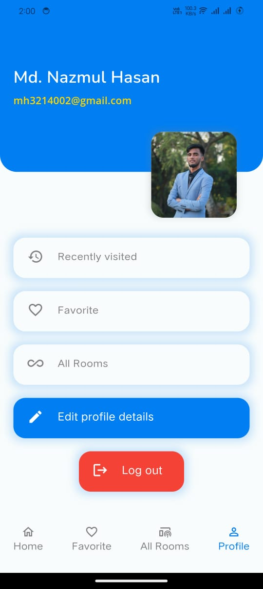
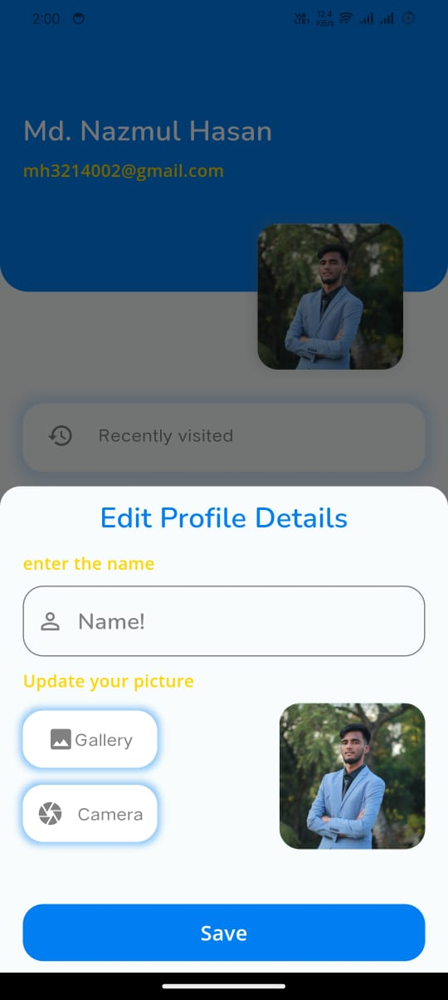

# 🏨 **Hotel Room Booking App**  
_Effortless hotel booking, stress-free travel._

---


## 📖 **About the Project**  
The **Hotel Room Booking App** is a platform that allows users to book hotel rooms quickly and easily, with secure payments via bKash. The app connects users to hotels, giving them access to real-time room availability, booking options, and convenient payment methods.  

---

## 🌟 **Key Features**  

- **Real-time Booking**: Book rooms instantly with live availability updates.  
- **bKash Payment Integration**: Seamless payment options using bKash.  
- **Smooth & Interactive UI**: User-friendly interface designed for easy navigation.

---

## 🛠️ **Tech Stack**  

- **Frontend**: Flutter 🦋  
- **Backend**: Developed by [RootHex200](https://github.com/RootHex200)  
- **Payment Integration**: bKash 💳  
- **UI/UX**: Custom design for an engaging user experience.

---

## 📦 **Dependencies**  

The following dependencies are used in this app:  

- `get: ^4.6.6`  
- `shared_preferences: ^2.3.3`  
- `dio: ^5.7.0`  
- `google_nav_bar: ^5.0.7`  
- `lottie: ^3.1.3`  
- `intl: ^0.20.0`  
- `flutter_bkash: ^0.2.0`  
- `image_picker: ^1.1.2`

---

## ⚡ **Getting Started**  

1. Clone the repository:  
   ```bash
   git clone https://github.com/alphabetic100/hotel-room-booking-app.git
   cd hotel-room-booking-app
   ```

2. Install dependencies:  
   ```bash
   flutter pub get
   ```

3. Run the app:  
   ```bash
   flutter run
   ```

---

## 📸 **App Screenshots**  

### 🔑 **Authentication Screens**  

<div style="display: flex; justify-content: space-around; flex-wrap: wrap;">
  
  
  
</div>

---

### 🌟 **Splash Screen**  
<div style="display: flex; justify-content: center;">
  
</div>

---

### 🏠 **Home Screen**  

<div style="display: flex; justify-content: space-around; flex-wrap: wrap;">
  
  
  
</div>

---

### 📝 **Details & Payment Screens**  

<div style="display: flex; justify-content: space-around; flex-wrap: wrap;">
  
  
</div>

<div style="display: flex; justify-content: space-around; flex-wrap: wrap;">
  
  
</div>

---

### 👤 **Profile Screens**  

<div style="display: flex; justify-content: space-around; flex-wrap: wrap;">
  
  
</div>

---

### 🎉 **Welcome Page**  
<div style="display: flex; justify-content: center;">
  
</div>

---

## 🌐 **Follow Us**  
Stay connected for more updates:  
[Twitter](https://x.com/MDNazmul_69) | [LinkedIn](https://www.linkedin.com/in/md-nazmul-hasan-095831251/)

---

## 📈 **Stats**  
[](https://github.com/alphabetic100/hotel-room-booking-app/stargazers)  
[](https://github.com/alphabetic100/hotel-room-booking-app/network/members)
```